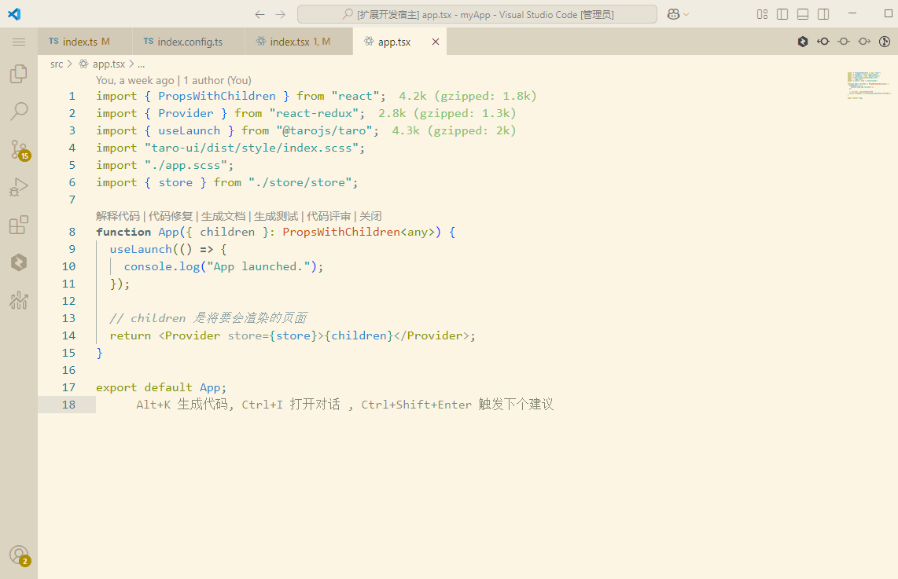
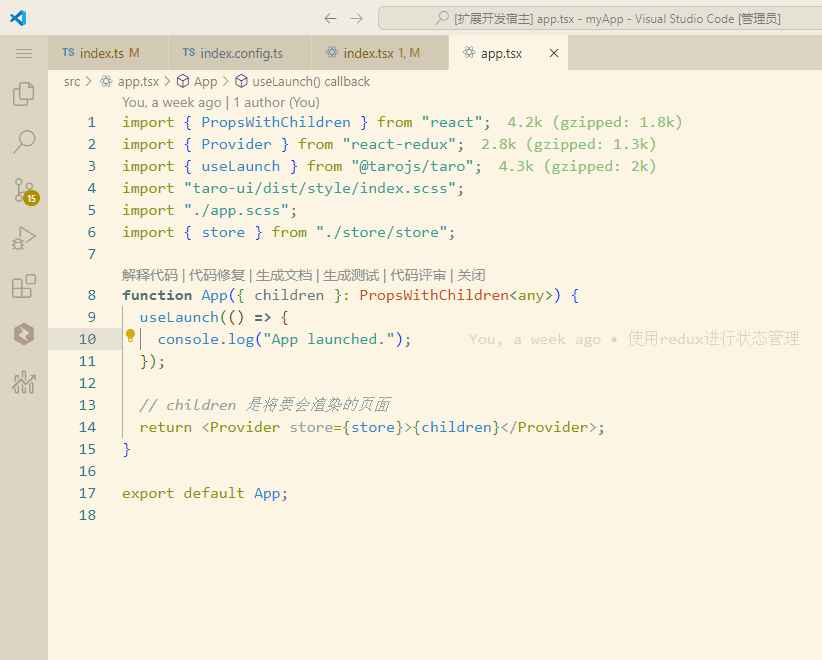

# Toggle Quotes Plus

`cmd '` (`ctrl '` on win/linux) will cycle the quote pair.

Or you can use the quick operation like this:

Also available different start and end of wrap characters:

`` "toggleQuotesPlus.chars": ["\"", "'", "`", "{,}", "[,]"] ``
